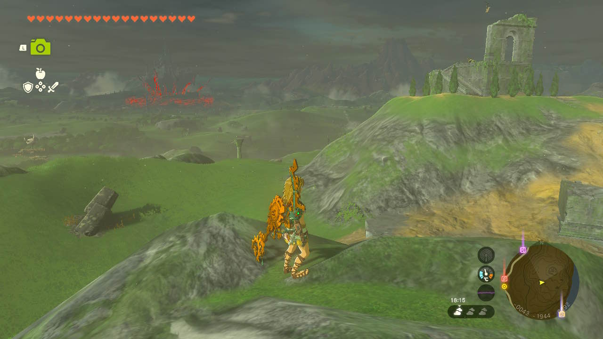
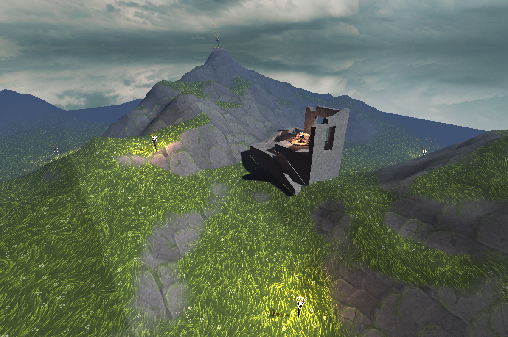
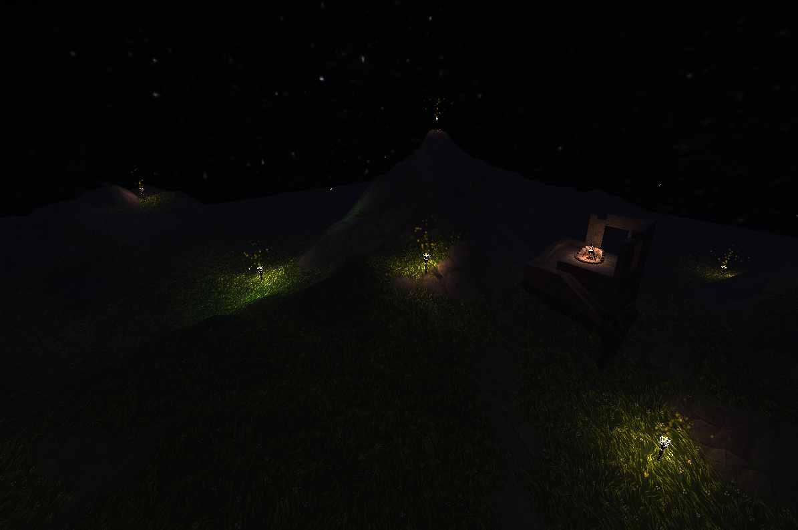
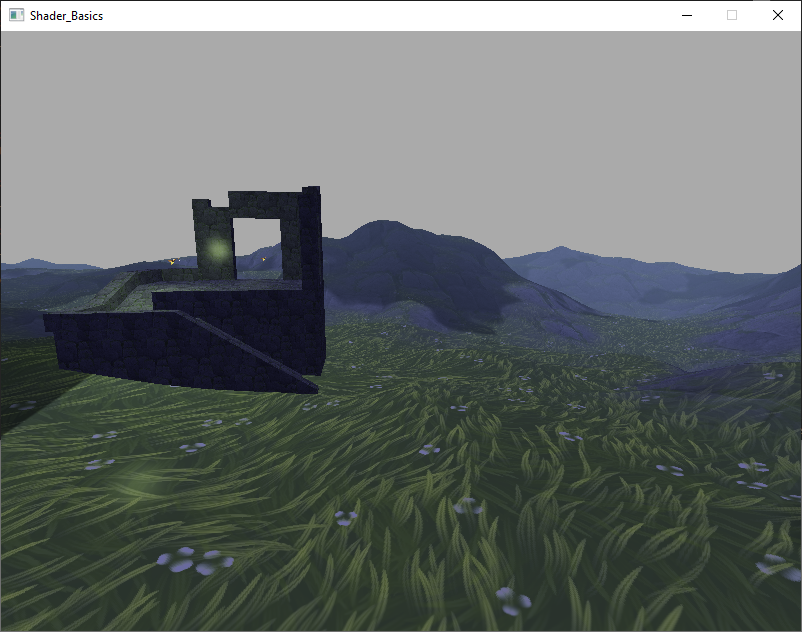
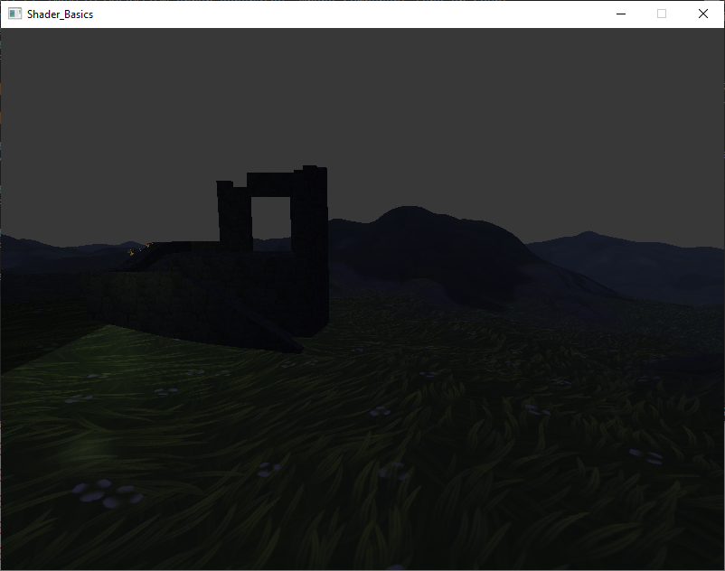

# 3015 Coursework 2 - Breath of the wild inpired scene 
By Oliver Warry

old demo video [here](https://youtu.be/KHnyvOIJeQM)

New demo video [here](https://youtu.be/xtAyVjFPfzc)

## Overview
Inspired by Tears of the Kingdom, I wanted to recreate the terrain and visual style of a place in the game with this old ruin perched on a hill. 


And this is my project outcome.



This is a continuation of the first stage project for this module, aiming to expand on the existing feature set with some more advanced features. The old readme for the previous version can be found in the repository files.

## Technical
Developed with Visual Studio 2022 and OpenGL 4.4.
### External Dependencies
[GLAD](https://github.com/Dav1dde/glad) | [GLFW](https://www.glfw.org/) | [GLM](https://github.com/g-truc/glm) | [FastNoiseLite](https://github.com/Auburn/FastNoiseLite) | [OpenGL](https://www.opengl.org/)

### Asset declaration
Some textures were not directly created by me, being sources from other sites. All citations and sources are held in [TextureSources.txt](media/texture/TextureSources.txt)

The ruin model present in the scene as well as the terrain were both modelled by me. Used textures are held in the textures folder. Asset sources also held in the media folder.

# Main features
## PBR
As visible in the scene, I use fragment based phong lighting. The fragment shaders [terrainPBR.frag](shader/terrainPBR.frag) and [PBR.frag](shader/PBR.frag) are good demonstrations. Uses the microfacet model explained on the [learnOpenGl site](https://learnopengl.com/Advanced-Lighting/Shadows/Shadow-Mapping) to implement physics based rendering. Uses the light's intensity value to attenuate the light source, an improvement over the Phong lighting model requiring specific attentuation values to achieve similar results.

## Shadow mapping
Visible in [PBR.frag](shader/PBR.frag) and [terrainPBR.frag](shader/terrainPBR.frag), shadow mapping allows for objects to obscure the light on others, creating cascading shadows across the terrain. It works by performing two passes of rendering. The first pass involved effectively moving the camera to the position of the light source (the sun in this case), and rendering the scene from that point of view, holding depth information in a texture. A second pass will render the scene from the intended camera position. Whenever a fragment is being rendered it's world position will be transformed using a matrix that places it on the previously aquired depth texture. The depths of the texel sampled and the world position of the fragment relative to the *light* then controls whether the fragment is in shadow or not.

In this project the light moves across the sky. It's angle is determined by the time of day, and it's angle is determined by rotating it to look at the centre of the scene. The result is a sun or moon light that changes the orientation of shadows as it moves.

## Animated skybox
The skybox follows the camera and rotates too, making it look like an infinitely expanding backdrop, rendered with [skybox.frag](shader/skybox.frag). It will rotate to match the defined length of a day, so the rotation of the skybox matches that of the sun, even if no visible sun can be seen. When it enters night time the texture will change to that of a night sky by mixing between both textures by a blend factor provided through uniforms.

## Fire particles
Each torch emits a stream of fire particles handled in [particleStream.vert](shader/particleStream.vert). This shader uses transform feedback to move the position and velocity calculations entierly to the GPU, avoiding the overhead caused by feeding data from the CPU to the GPU using approaches like uniforms or buffer sub data.

During initialisation several buffers are created to hold information pertaining to position, velocity and age of all existing particles. There are currently 8 emitters in the scene, so given that a single shader and buffer is used, the positions for all particles can exist in one buffer but it can be split based on the number of emitters. Each instance of a particle is therefore assigned an index that determines which emitter it belongs to.

The transform feedback approach allows the shader to perform calculations on the position to move to next frame, and feeds that back into it's own buffer. This avoids the need to calculate the positions on the CPU (which is how the firefly particles work), great for when there are many particles at any given time. It will render the first pass as an update pass, then use the new positions to render the vertices for particles. Then when the particle needs to spawn it calculates a new initial velocity within the shader itself, using that in the next update run.

## Firefly particles
Fireflies use a less optimised version of the above solution. A custom fireFly class will create a new velocity on each frame, which then passes that to the shader via uniforms. It made more sense to use this approach for fireflies since there are far fewer particles, roughly 15 in contrast to the 360 active for fire effects. It also allows for other shaders to use information about the position of fireflies to create new light sources.

## Day night cycle
The time of day will increment over time from 0-2, where 0 is dawn, 1 is sunset and 2 is 'moonset'. A collection of structs that detail information about each time of day (example below) allows 
```C++
TimeOfDayInfo dayInfo = {
	"day",
	vec3(0.5f, 0.5f, 0.65f), //Ambient light colour
	vec3(1.0f, 1.0f, 1.0f), //Light colour
	{
		vec3(0.5f, 0.65f, 0.9f) * 0.5f, //Fog colour
		10.0f, //Fog start
		30.0f //Fog end
	},
	0.7f, //Light intensity
	0.2f, //Ambient light intensity
	0.09f, //Start time
	0.05f //Ramp up time
};
```
As time passes, whenever the start time for the next time of day is passed it will change the lighting of the scene to match that time of day. So in daytime it will br brighter with high ambient light intensity, at night there will be less fog and less light but said light will be a more purple-y colour. Other aspects like sun movement and skybox rotation also rely on this value.

## Gamification
The project has some rudementary game systems. There is a cooking pot in the ruin, reminiscient of the cooking system in Breath of The Wild. It requires you to collect some ingredients. Scattered around the map are several ingredients. Move over to them and press E when near them to pick them up. After collecting all 3 items you can return to the pot and press the key again to 'cook' an item, beating the game.

There is a time limit too. If you do not find all the ingredients before the start of the next day, you lose and cannot continue picking items up. (but the scene will continue to allow for visualisation of the scene without a time limit)

# Missed features
There were a few features I wanted to implement but couldn't due to time constraints. The biggest one being the ability to walk on the actual terrain. As it stands (pun intended) you move through the scene by flying around it, I would have preferred it if you could walk on it. I know that if I were to implement this, I would take a similar approach to the shadow map. I'd have a top down orthographic camera that renders the terrain and save its depth information to a texture. Then if I come up with a matrix that I can use to transform my world position into a texture coord on that texture, I could sample the height of the pixel I am standing on and change the camera height based on the value it returns.

That idea works in my head, and could be used for things like object scattering where I could determine the x and z coords for objects randomly and use the depth map to place it on the surface.

A few other things would have been music, cooking animations, in game ui elements to make it clear when you've won and so forth.

# Old Features

## Basic Texture Sampling
Objects (the ruin in this case) has a simple texture sampling approach. UVs have been defined in Blender after unwrapping, so in [object.frag](shader/object.frag) the texture colour for the fragment is sampled with a slight alteration to the texCoord it will be sampling from. The texture was improperly rotated when I first imported it, and ended up using a rotation matrix to rotate it 90 degrees to get the proper rotation while also scaling it to the correct size. The phongModel then uses this texture colour in it's lighting calculations.

## Lighting subtechniques
Two lighting subtechiques were used for this scene - fog and multilight. 

### Fog
Fog is a fairly simple implementation and can be seen in [Terrain.frag](shader/terrain.frag). I get the position of the fragment in world space and the position of the view in world space and calculate the distance between them. Fogfactor is a 0 - 1 value that linearly interpolates between the fogStart value and fogEnd value, where the fog starts to become visible and when the fog is strongest, respectively. It then just mixes what would be the final colour of the fragment with this fog colour.

### Multilight
Shaders hold collections of multiple lights that are assigned through uniforms in code. By iterating through each light, the actual lighting value of the currently observed fragment can be accumulated by adding the result of each lighting calculation.


## Texturing subtechniques
Two texturing techniques were used here alongside basic texture sampling - Texture mixing and alpha discard
### Texture mixing - Cloud shadows
I have two instances of texture mixing in the scene. The first is a rolling cloud shadow effect on the terrain. While the scene is set at night, it's meant to be an open countryside setting, so the sky is clear and clouds can obstruct the moonlight. This is the effect i'm aiming to replicate.

 In [scenebasic_uniform.cpp](scenebasic_uniform.cpp) 's initScene method, I generate a noise texture for clouds using fastNoiseLite, generating a 2048x2048 texture used in [Terrain.frag](shader/terrain.frag). To create the moving cloud effect I have altered the texture coordinate to sample from based on time, with some variation added to give it some more variance in movement. Time is passed in as a uniform at the start of the update method in [scenebasic_uniform.cpp](scenebasic_uniform.cpp), so that it holds the time in seconds since the application started. By getting the world position of the fragment (so multiple objects look to have the same cloud coverage independant of position or size) and adding on this animation coordinate offset, a noise value is generated after sampling the texture. Since it is a black and white image, only the red channel needs to be used. Then decreases the intensity of the shadow with an initial mix function. After the base lighting has been calculated it will mix the final output with this shadow to reduce the brightness of the fragment, simulating cloud shadows while not making said shadows pitch black.

```GLSL
void main() {
    float noiseScale = 0.002f;
    float speed = 0.5f;    

    float animatedX = time * speed + sin(time * 0.1f) * 0.1f;
    float animatedY = time * speed + cos(time * 0.12f) * 0.1f;
   
    vec2 animatedCoord = WorldPosition.xz * noiseScale + vec2(animatedX, animatedY);
    float noise = texture(CloudTex, animatedCoord).r;  


    float shadow = smoothstep(0.0, 0.05f, noise); 
    shadow = mix(shadow, 1.0, 0.35);
    ...
    vec3 colour = vec3(0.0);    
    for (int i = 0; i < MAX_NUMBER_OF_LIGHTS; i++)
    {        
        colour += phongModel(i, Position, adjustedNormal, blendedTex.rgb);
    }  
    
    vec3 finalColour = mix(colour, colour * shadow, 0.9);
```

### Texture mixing - Terrain surface
I wanted to look into a way to give the terrain some better variation and detail without just using random splotches of noise, and after doing some research found [this video](https://www.youtube.com/watch?v=rNuDkDhadfU)  on various texture blending methods. Triplanar mapping was one that caught my eye, so I chose to implement it for my terrain in the scene. Previous commits show moments where I added this and reinvented them to better suit my approach, but in the end I found a much simpler method of achieving similar results.

Triplanar mapping works by sampling 3 textures by projecting them onto the fragment from the 3 different axes, choosing the weighting for each projected texture based on the normal of the fragment. Since it is based on world position, and uses 3 planes, it means really vertical surfaces don't have that stretched look that sharp terrain can produce.
```GLSL
    vec3 blending = normalize(abs(WorldNormal));
    
    
    //Create texture coordinate positions based on the fragment's world position
    vec2 xzProj = WorldPosition.xz;
    vec2 xyProj = WorldPosition.xy;
    vec2 yzProj = WorldPosition.yz;   

    vec3 texXZ = texture(GrassTex, xzProj).rgb; // Top-down
    vec3 texXY = texture(CliffTex, xyProj * TextureScale).rgb; // Side projection
    vec3 texYZ = texture(CliffTex, yzProj * TextureScale).rgb; // Side projection
    vec3 triplanarTex = texXZ * blending.y + texXY * blending.z + texYZ * blending.x;
```
This solution worked, but I eventually found a much simpler way to achieve this. 

The idea behind this new approach is that you look at a fragment's normal value in world space. The colour represents direction, so it's y component wil be high if it's a flatter surface. So creating a slopeFactor blend value based on the intensity of that vertical component can be used to mix between rock and grass, where it is grassy when that slopeFactor is high (plane is horizontal). This achieves that same texture blending look, but without the sideways projection that can help avoid texture stretching. However since none of my terrain is particularly vertical, I can get by with this simpler method and it looks just as good.

```GLSL    
    //If WorldNormal.y < 0.9, slopeFactor is 0, between 0.9 and 1.0 it smoothly blends from 0 to 1, and when WorldNormal.y > 1.0, slopeFactor is 1
    float slopeFactor = smoothstep(0.9, 1.0, abs(WorldNormal.y));     

    //Scale the textures
    vec3 grassTex = texture(GrassTex, TexCoord * TextureScale).rgb;
    vec3 rockTex = texture(CliffTex, TexCoord * TextureScale).rgb;
  
    vec3 blendedTex = mix(rockTex, grassTex, slopeFactor);
```

### Alpha Discard
In my [particle.frag](shader/particle.frag) shader, the shader responsible for rendering the firefly particle effects, I make use of alpha discard. The image has an alpha channel so that only the fly itself is seen, and it will simply discard fragment pixels if the alpha is low enough.

```GLSL
void main() {
    
    vec4 texColor = texture(spriteTex, TexCoord);    
    
    if (texColor.a < 0.1) {
        discard;
    }
    FragColour = texColor;
}
```


## Light Animation
My fireflies spawn in dynamically, move around and then despawn. In the update method of [scenebasic_uniform.cpp](scenebasic_uniform.cpp) a timer will count up when there are fewer than the max number of fireflies present, which will spawn a new one once it reaches a spawnCooldown value. It chooses a random location with a set region, creates a new fireFly and pointLight object and adds it to a container holding all active fireflies. The same update method then also iterates through all active firflies and checks `shouldDestroy`, destroying the light and disabling it in the shader. Render will then iterate through active fireFlies and update the shader light array so it matches their current state.

## HDR
Implementing HDR has been rather fussy. I did manage to get it working, with tonemapping, exposure and gamma correction by rendering to a framebuffer and then a texture, but doing so for some reason had my skybox fail to render. The project as it is currently has HDR disabled so that I can properly display the skybox. 

However, the back end setup and implementation for HDR does still exist. Inside of setupFBO I create the hdrFBO, create and assign it a texture target to render to, create the depth buffer and bind it. It's just that inside of render it calls `glBindFramebuffer(GL_FRAMEBUFFER, 0);` to allow for the skybox to render as intended. If I uncomment the code after the second pass marker in the render method as follows and change the framebuffer target to the hdrFBO in the render method too, it shows the implementation of HDR in action.
```GLSL
	...
    TerrainMesh->render();

	//Second pass - HDR		
	glBindFramebuffer(GL_FRAMEBUFFER, 0);
	glDisable(GL_DEPTH_TEST);	
	screenHdrProg.use();
	model = mat4(1.0f);
	view = mat4(1.0f);
	projection = mat4(1.0f);
	setMatrices(screenHdrProg);
	screenHdrProg.setUniform("hdr", hdr);
	screenHdrProg.setUniform("exposure", exposure);
	glBindVertexArray(fsQuad);
	glActiveTexture(GL_TEXTURE8);
	glBindTexture(GL_TEXTURE_2D, renderTex);
	glDrawArrays(GL_TRIANGLES, 0, 6);	

}
```
HDR on with exposure set to 2.2

HDR on with exposure set to 0.5


This renders to a texture and then renders onto a full screen quad as is required for HDR, handled in the [screenHdr.frag](shader/screenHdr.frag) shader. The functionality is there, just disabled as I figure out how to fix the skybox.

